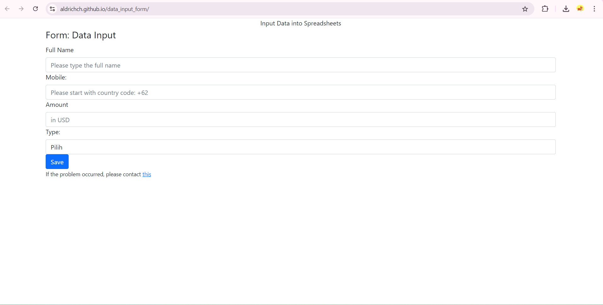
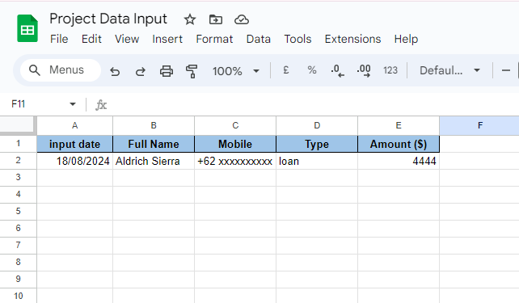

I'm trying to create my own "Google form" with Google Apps Script and HTML. I'm using GitHub to host it and make the form available online. However, only certain users or emails can submit as the users need their email permitted by the spreadsheet owner.

This is the form or you can visit https://aldrichch.github.io/data_entry_form/

  

and this is the output in the spreadsheet

  

