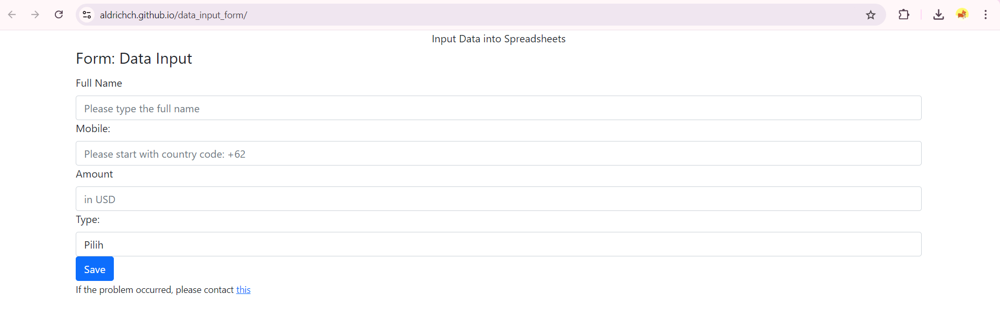

I'm trying to create my own "Google form" with apps script and HTML. I upload the HTML code here as I can host it and the form can be available online. However, only certain emails can be input as the users need their email permitted by me.

This is the form display or you can visit https://aldrichch.github.io/data_input_form/

  

and this is the output in the spreadsheet

  

